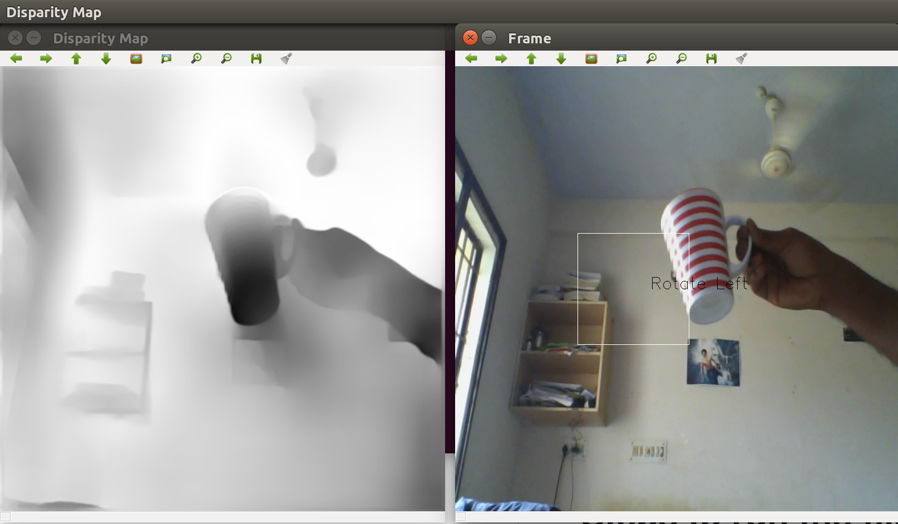

# Depth Prediction
This module is used for depth prediction from a monocular image.

# Dependencies
[pyTorch](https://pytorch.org/)

# Steps to run the file 
1) Clone this Directory

2) Run the test.py file (Directory Should be this)
  > python test.py
  
You can see two windows, one is the RGB image and the other is the gray scaled depth map.

# Results 
Depth map from a monocular image (Web-Cam)  

